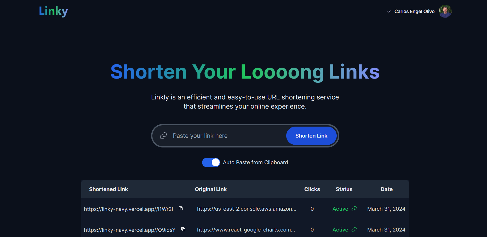
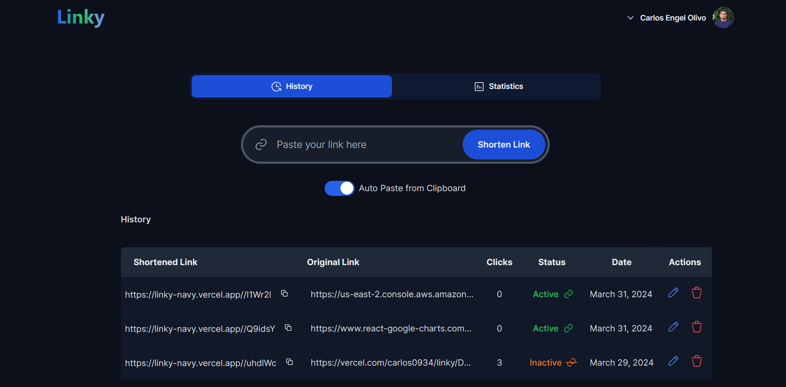

<h1 align="center">
 Linky 
</h1>

<p align="center">
  <strong>Linky is a URL shortener service that allows you to shorten long URLs into short links.
    <a href="https://linky.carlos-olivo.dev">View Demo</a>
  </strong>

  
</p>


## Features

- Shorten long URLs into short links
- Authentication with NextAuth.js with Github
- View all links created by a user in the dashboard
- Short links statistics (clicks,browser,os)

## Tech Stack

- Next.js
- Tailwind CSS
- TypeScript
- Turso (Sqlite database)
- Vitest (Testing library)

## Getting Started

First, clone the repository:

```bash
git clone https://github.com/Carlos0934/linky.git linky
```

Then, navigate to the project directory:

```bash
cd linky
```

Install the dependencies:

```bash
npm install 
```

Create a `.env.local` file in the root of the project and add the following environment variables:

```bash
DATABASE_URL=<your_database_url>
DATABASE_AUTH_TOKEN=<your_auth_token>
BASE_URL=http://localhost:3000 
GITHUB_APP_CLIENT_ID=<your_github_app_client_id>
GITHUB_APP_CLIENT_SECRET=<your_github_app_client_secret>
NEXTAUTH_SECRET=<your_nextauth_secret>
```

Create database migrations:

```bash
npm run generate
```

Run the migrations:

```bash
npm run migrate
```

Start the development server:

```bash
npm run dev
```

Open [http://localhost:3000](http://localhost:3000) in your browser.

## Testing

Run the tests:

```bash
npm run test
```


## Images

### Home Page


### Dashboard




